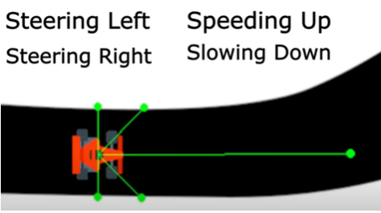
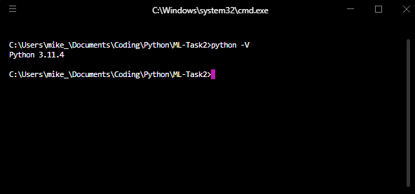

# Machine Learning Task 2

## AI Car Simulation and Code Analysis

### All necessary files for this task can be found linked to this document

Run the code via your favourite IDE. I use VSCode which you can find here: https://code.visualstudio.com/download Don’t worry it is free! Be sure to get the version for your operating system. Install it.

In your terminal, check your version of python, using the python -V command:

If you get an error message (or your version is not python 3.x.x), that means you do not have the proper python installed on your machine. 

Go to Python.org: https://www.python.org/downloads/ and download and install the version for your OS. Be sure to restart VSCode for the effects to take hold.

In your IDE (VSCode), open the folder in which the AI-Simulation code resides.  

## You will need to install the libraries that this program requires.

Open a terminal inside VSCode:

Run the following commands:

>pip install neat-python

>pip install pygame

Run:
>pip list

(you should see all the above libraries) 

## Run the simulation by typing the following command in the terminal: 

>python newcar.py

The game will start and begin evolving cars!

## Keyboard Shortcuts

You can exit the game by typing:
>alt-f4 - (Win)

>cmd-q - (Mac)

You can shrink the window to see the stats by typing:
>alt-tab

If all this does not work, stare out the window for a minute, get up and take a short break. It should be all good when you get back.

Then go to the EDStem forum and explain what you are seeing.

## Common Problems

Python not found - try:
 >python3

Pip not found - try:
>pip3

Otherwise install the latest version of Python. 
*Python be like that*
If you see:
>(base)

in the terminal, run:

>conda deactivate

this exits the anaconda virtual environment

Screen size not correct - We're working on that... (Learn some Pygame)

## Essential Study List - Genetic Algorithm NEAT

- [Neuroevolution of Augmenting Topologies - NEAT](https://www.youtube.com/watch?v=b3D8jPmcw-g&t=635s)
- [The NEAT Documentation - NeuroEvolution of Augmenting Topologies](https://neat-python.readthedocs.io/en/latest/neat_overview.html)
- [NEAT: An Awesome Approach to NeuroEvolution](https://towardsdatascience.com/neat-an-awesome-approach-to-neuroevolution-3eca5cc7930f)
- [Visualizing NEAT](https://www.youtube.com/watch?v=j8oU0ksQ3Bc&t=2s)
- [NEAT - Introduction](https://www.youtube.com/watch?v=VMQOa4-rVxE)
- [Super MarI/O](https://www.youtube.com/watch?v=qv6UVOQ0F44&t=5s)
- [Activation Functions](https://www.v7labs.com/blog/neural-networks-activation-functions)
- [Self-Driving AI Car Simulation in Python](https://www.youtube.com/watch?v=Cy155O5R1Oo)
- [Get Started in Pygame in 10 minutes!](https://www.youtube.com/watch?v=y9VG3Pztok8)

## Credits

NeuralNine - Florian Dedov
